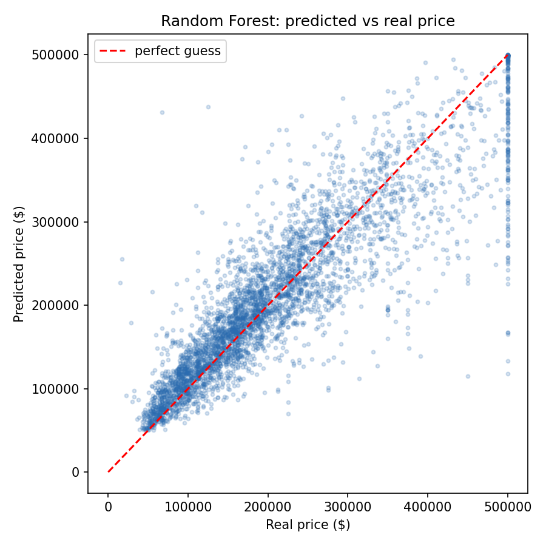

# House Price Prediction

A machine learning model that predicts house prices in California, trained on the
[California Housing dataset](https://www.kaggle.com/datasets/camnugent/california-housing-prices)
from Kaggle.

Give it a neighbourhood — income level, number of rooms, how close it is to the
ocean — and it tells you what homes there are worth.

## Results

| | |
|---|---|
| **Accuracy** | **82.3%** |
| **Average error** | $31,588 |
| **R² score** | 0.817 |
| **Average house price** | $206,856 |

**What "82.3% accurate" means here.** Predicting a price is not a right-or-wrong
answer like a yes/no question, so accuracy is measured by how *close* the guess
lands. Each guess is scored by how far off it is as a share of the real price,
and those misses average 17.7% — so the model is 82.3% accurate.

In plainer terms:

| | |
|---|---|
| Guesses within 10% of the real price | 44 out of 100 |
| Guesses within 20% of the real price | 71 out of 100 |

The **R² score of 0.817** is the measure a data scientist would ask for. It says
the model explains 81.7% of why prices differ between neighbourhoods. A score of
1.0 would be perfect; 0.0 would mean the model is no better than always guessing
the average price.



Each dot is one neighbourhood. The red line is a perfect guess — the closer the
dots sit to it, the better the model did. The flat row of dots along the top is
a quirk of the data, not the model: every neighbourhood worth more than $500,000
was recorded as exactly $500,001, so 965 of them are squashed together at the
ceiling and cannot be predicted properly.

## Two models, compared

| Model | Accuracy | Average error | R² |
|---|---|---|---|
| Linear Regression | 70.8% | $50,670 | 0.625 |
| **Random Forest** | **82.3%** | **$31,588** | **0.817** |

Linear Regression draws one straight line through the data. Random Forest asks
hundreds of yes/no questions instead ("is income above 3?", "is it inland?") and
averages the answers, so it can handle the fact that price does not rise in a
straight line. It cut the error by **$19,000 per house**, so it is the one kept.

## What actually decides the price

| Feature | How much the model leans on it |
|---|---|
| Median income of the area | **49.1%** |
| Being inland | 14.1% |
| Longitude | 10.6% |
| Latitude | 10.2% |
| Age of the houses | 5.2% |

Income alone explains about half the answer — richer areas have pricier homes,
which is not surprising. The next three are all really the same thing: **location**.
Being inland instead of near the coast is the single biggest price killer:

| Location | Average price |
|---|---|
| Near the bay | $259,212 |
| Near the ocean | $249,434 |
| Within an hour of the ocean | $240,084 |
| **Inland** | **$124,805** |

Inland homes are worth roughly **half** what coastal homes are.

## How it works

1. **Load** — 20,640 California neighbourhoods from the 1990 census.
2. **Fill gaps** — 207 rows are missing `total_bedrooms`. They get the middle
   value of that column, because a house obviously has bedrooms — the number was
   just never recorded.
3. **Rescale** — `total_rooms` runs into the thousands while `median_income` sits
   around 3. Without rescaling, the model would assume rooms matter more purely
   because the numbers are bigger.
4. **Convert words to numbers** — `NEAR BAY` becomes a column of 1s and 0s, since
   a model can only do maths on numbers.
5. **Split** — 80% to learn from, 20% hidden away and used only for the final
   score, so the result is honest.
6. **Train and compare** — both models are trained, the better one is saved.

Steps 2, 3 and 4 all live *inside* the saved model file, so `predict.py` cannot
prepare the data differently from how it was trained. That is the usual way these
projects break.

## The website

Type in a neighbourhood and it prices it instantly. There is no server — the
browser downloads the model as JSON and does the maths itself, so nothing you
type is ever sent anywhere.

`src/export_for_web.py` converts the trained forest into `web/model.json`: the
questions each tree asks, the price at the end of each branch, and the numbers
needed to prepare the input. The JavaScript then walks all 40 trees and averages
them, which is exactly what scikit-learn does in Python.

Verified: the browser's answers match scikit-learn's to within **2 cents** across
all 4,128 test neighbourhoods.

### Deploying it

The site is static, so it needs no server. On [vercel.com](https://vercel.com),
**Add New → Project → Import** this repository and deploy. `vercel.json` already
points Vercel at the `web/` folder. If the deploy comes up empty, set **Root
Directory** to `web` in the project settings instead.

Or from the command line:

```bash
brew install vercel
vercel login
vercel --prod
```

## Running it

```bash
git clone https://github.com/kunalkapil0-sys/house-price-prediction.git
cd house-price-prediction

python3 -m venv .venv
source .venv/bin/activate
pip install -r requirements.txt

python src/download_data.py   # get the dataset
python src/train.py           # train the model (takes about 20 seconds)
python src/predict.py         # predict some prices
python src/export_for_web.py  # rebuild web/model.json for the website
```

The trained model file is not stored in this repo. It is 17 MB of saved decision
trees, which is a build output rather than source code. `train.py` rebuilds it
identically every time, because the random seed is fixed.

### Getting the data from Kaggle

`download_data.py` uses the Kaggle API if it can. Make a token at
[kaggle.com/settings](https://www.kaggle.com/settings) → **API → Create New Token**,
then:

```bash
mkdir -p ~/.kaggle && mv ~/Downloads/kaggle.json ~/.kaggle/
chmod 600 ~/.kaggle/kaggle.json
```

Without a token it downloads an identical public copy instead, so it works either way.

## Example output

```
 income (10k$)  rooms  location predicted price real price
           3.2   2810 <1H OCEAN        $346,679   $355,000
           2.0   2185    INLAND         $68,569    $70,700
           4.0   1819  NEAR BAY        $236,415   $229,400
           1.5    340  NEAR BAY        $117,505   $112,500
           5.2   1530 <1H OCEAN        $249,886   $225,400
```

## Project layout

```
data/       the dataset
src/        download, train, predict and export scripts
models/     the trained model
reports/    the chart and the scores
web/        the website, and the model exported as JSON
```

## Limitations

- The data is from the **1990 US census**, so these are 1990 prices. The method
  still works, the numbers are just old.
- Prices were capped at $500,001, so the model can never correctly price an
  expensive home.
- Each row is a whole neighbourhood, not a single house, so this predicts what
  homes in an area are worth on average — not what your specific house is worth.
